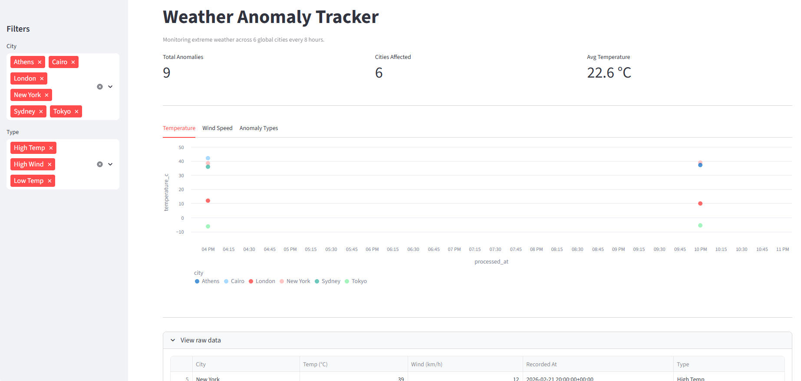
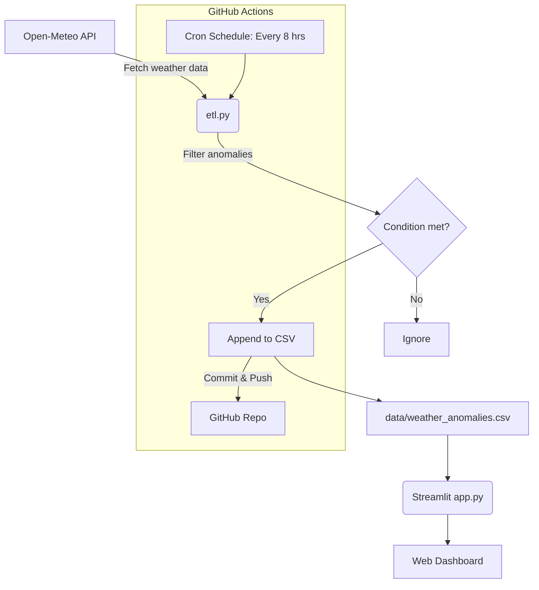

# Global Weather Anomaly Tracker

A serverless ETL pipeline and frontend dashboard designed to track extreme weather anomalies across 6 major global cities. This project leverages GitHub Actions for automated orchestration and Streamlit for an interactive data visualization interface.

## Dashboard Preview



## Features
- **Data Ingestion**: Fetches real-time weather data from the [Open-Meteo API](https://open-meteo.com/).
- **Data Transformation**: Filters data to detect weather anomalies (Temperature > 35°C or < -5°C, or Wind Speed > 30 km/h).
- **Automated Workflow**: Uses GitHub Actions to run the ETL pipeline every 8 hours and continuously store historical CSV data in the repository.
- **Interactive Dashboard**: A dynamic Streamlit app to visualize trends and raw anomaly data.

## Architecture



## Tech Stack
- **Python**: Pandas, Requests
- **Orchestration**: GitHub Actions
- **Frontend**: Streamlit
- **Data Storage**: CSV stored directly in the GitHub repository

## How to Run Locally

1. **Install dependencies**:
   ```bash
   pip install -r requirements.txt
   ```

2. **Run the ETL script manually**:
   ```bash
   python etl.py
   ```

3. **Launch the Streamlit app**:
   ```bash
   streamlit run app.py
   ```